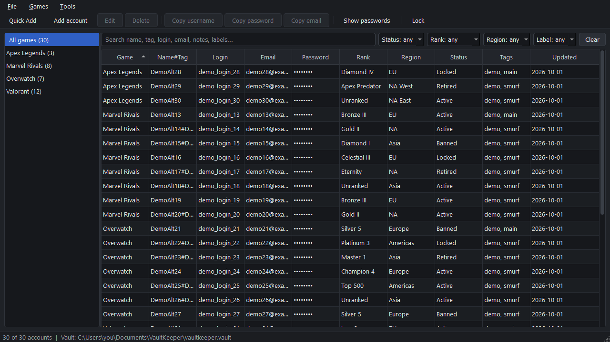
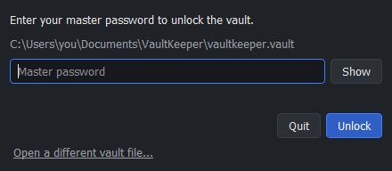
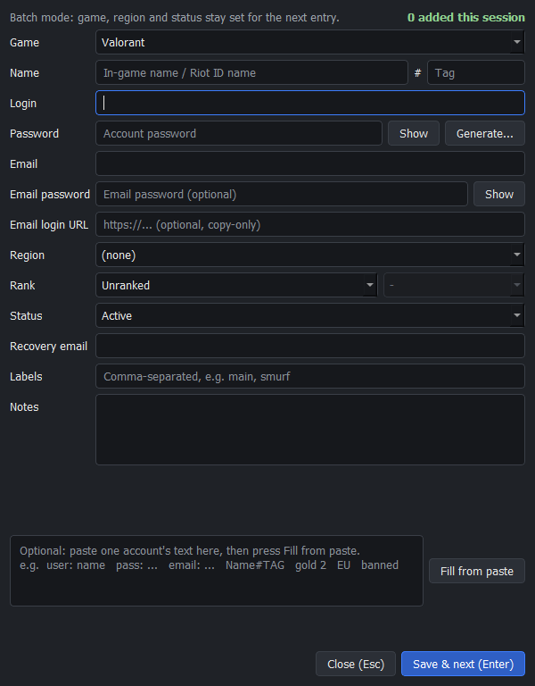
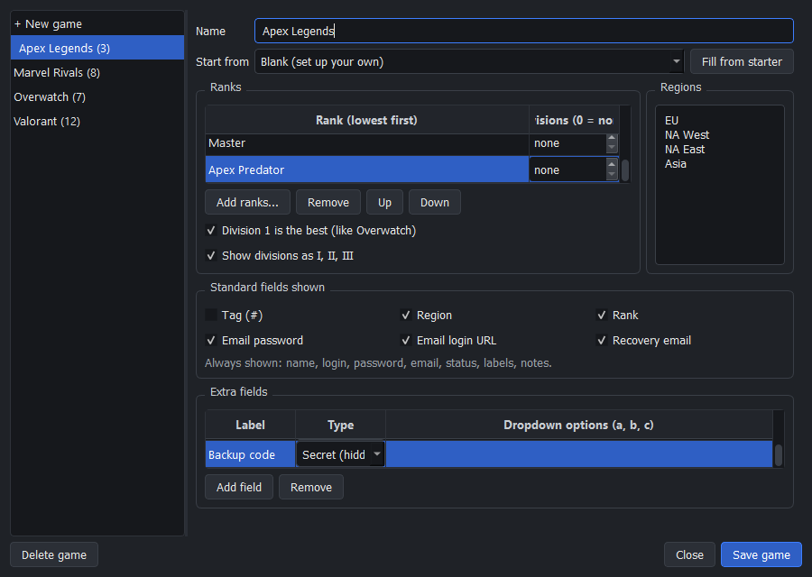
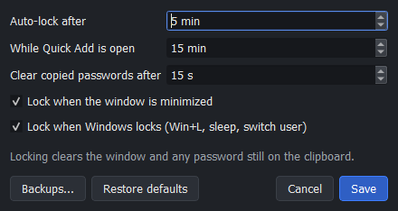

<div align="center">


# Account Manager - By BigH

**A fully offline, encrypted password manager built for gamers with lots of accounts.**

Organize hundreds of game accounts by game, rank, region and status. Everything lives in one
encrypted file on your own PC. No cloud, no sync, no network: ever.




<sub>All screenshots use the built-in demo mode: every account shown is fake.</sub>

</div>

---

## Contents

- [Why this exists](#why-this-exists)
- [Features](#features)
- [Screenshots](#screenshots)
- [Getting started](#getting-started)
- [First-time setup](#first-time-setup)
- [Keyboard shortcuts](#keyboard-shortcuts)
- [Security](#security)
- [Backups, export and recovery](#backups-export-and-recovery)
- [Settings and where files live](#settings-and-where-files-live)
- [Project structure](#project-structure)
- [Development](#development)
- [Roadmap](#roadmap)
- [FAQ](#faq)
- [License](#license)

---

## Why this exists

General-purpose password managers are built around websites. A gamer with a large number of
accounts across several games needs something different: accounts grouped by **game**, with each game's own **ranks**, **regions** and **statuses**
(active, banned, locked, retired), and a way to enter a lot of accounts **fast, by keyboard
alone**.

Account Manager is built for exactly that, and it is deliberately **local-only**. Your vault
never leaves your machine, and the app contains no networking code at all.

---

## Features

### Organized around games
- **Game sidebar** with account counts per game, plus an "All games" view.
- **Per-game templates.** Every game has its own editable rank ladder (tiers with 0-10
  divisions, numbered or Roman), regions, which standard fields are shown, and **extra
  fields** (text, number, dropdown or hidden secret).
- **Rank pictures.** Give any rank a picture from your own .ico or .png file (Game setup ->
  Set picture...). It shows next to the rank in the account list, the rank picker and the
  rank filter. Pictures are shrunk to 64x64 and stored inside the encrypted vault. No rank
  art ships with the app: game rank icons belong to their publishers.
- **Starter templates** for Valorant, Marvel Rivals and Overwatch, or set up any game yourself.
- **Editing a template never deletes data.** Values that are no longer in a game's list are
  kept and clearly marked "(not in this game's list)".

### Fast entry
- **Quick Add** (`Ctrl+Shift+N`): Enter saves and starts the next account immediately.
  Game, region and status stay set between entries (batch mode), with an
  "N added this session" counter.
- **Paste assist:** paste one account's text (`user: ... pass: ... email: ...`,
  `Name#TAG`, `gold 2`, `EU`, `banned`...) and press *Fill from paste*. It only fills empty
  fields and never saves on its own.
- **Duplicate warning** when the same login or Name#Tag already exists for that game.
- Only one identifier is required (login, in-game name or email). Everything else is optional.

### Finding accounts
- **Instant search** across names, tags, logins, emails, notes, labels and extra fields.
  Passwords and other secrets are never searched.
- **Filters** for status, rank, region and labels, and **rank-aware sorting** (Iron to Radiant,
  not alphabetical).

### Everyday safety
- **Copy without revealing:** `Ctrl+B` username, `Ctrl+C` password, `Ctrl+E` email.
  Copies are **cleared from the clipboard automatically** (default 15 s) and are excluded
  from Windows clipboard history and cloud clipboard where Qt allows.
- Passwords are **masked** everywhere until you choose to show them.
- **Auto-lock** after inactivity (default 5 min, 15 min while Quick Add is open), when the
  window is minimized, and when Windows locks (`Win+L`, sleep, switch user).
- Locking wipes the decrypted data from the window, closes every dialog and **hides the main
  window** until the master password is entered again.
- **Password generator** (`Ctrl+G`) using Python's cryptographically secure `secrets` module.

### Your data is safe
- **Rotating encrypted backups** to a folder you choose (ideally another drive), keeping the
  newest 10 by default.
- **Crash-safe saving:** every save is written to a temporary file, verified by decrypting it
  again, and only then swapped in, keeping the previous version as `.bak`.
- If the vault file is ever damaged, the unlock screen **offers** the backup copy. It never
  switches silently.
- **Encrypted export** with its own separate password.
- A **standalone recovery script** that can decrypt your vault even without the app.

### Polish
- Dark theme, custom app icon on every window and the Windows taskbar.
- Remembers the window's size, position and maximized state.
- A friendly "Something went wrong" notice for unexpected errors. The app keeps running and
  your saved data stays intact.
- **Demo mode** (`--demo`) with a throwaway vault full of fake accounts, to try everything
  safely.

---

## Screenshots

| Unlock | Quick Add |
|:---:|:---:|
|  |  |

| Game setup (per-game ranks, regions and extra fields) | Settings |
|:---:|:---:|
|  |  |

---

## Getting started

### Requirements
- **Windows 10 or 11** (the app is cross-platform where it costs nothing, but Windows is the
  tested target).
- **Python 3.11 or newer** ([python.org](https://www.python.org/downloads/)).

### Install

```powershell
git clone https://github.com/BigH018/password-project.git
cd password-project

py -3.11 -m venv .venv
.venv\Scripts\Activate.ps1
pip install -r requirements.txt -r requirements-dev.txt
pip install -e .
```

All dependencies are pinned to exact versions in `requirements.txt` and
`requirements-dev.txt`.

### Run

```powershell
python -m vaultkeeper          # start the app
python -m vaultkeeper --demo   # try it with fake accounts (nothing real is touched)
```

**Demo mode** creates a temporary vault full of obviously fake accounts in your system temp
folder, with its own settings and logs. The demo master password is `test` (allowed only
for the throwaway demo; real vaults need a strong one). Everything is deleted when you quit, and your real settings and
vault are never touched.

> A standalone Windows `.exe` (no Python needed) is planned. See the [Roadmap](#roadmap).

---

## First-time setup

1. **Create your vault.** On first start, choose *Create a new vault*, pick where to save it
   (default: `Documents\VaultKeeper\vaultkeeper.vault`) and choose a master password of at
   least 12 characters (spaces at the ends and invisible characters don't count). A passphrase of several random words is easiest to remember and
   hardest to crack. The strength meter gives live feedback.
2. **Write your master password down** and keep it somewhere safe and offline.
   **There is no reset and no recovery.** See [FAQ](#faq).
3. **Turn on backups:** *File -> Backups...* and choose a folder, ideally on another drive or
   a USB stick. A yellow "Backups are off" banner reminds you until you do.
4. **Set up your games:** *Games -> Game setup...* Start from a built-in starter or a blank
   template, then adjust ranks, regions and extra fields to taste.
5. **Add accounts quickly** with **Quick Add** (`Ctrl+Shift+N`): type, press Enter, repeat.
6. Once everything is in the vault, **delete any old plaintext text files** that held your
   passwords.

---

## Keyboard shortcuts

| Shortcut | Action |
|---|---|
| `Ctrl+Shift+N` | Quick Add (batch entry) |
| `Ctrl+N` | Add account |
| `Enter` / double-click | Edit the selected account |
| `Delete` | Delete the selected account (asks first; only while the table has focus) |
| `Ctrl+B` | Copy username |
| `Ctrl+C` | Copy password |
| `Ctrl+E` | Copy email |
| `Ctrl+G` | Password generator |
| `Ctrl+,` | Settings |
| `Ctrl+L` | Lock now |
| `Ctrl+Q` | Quit |

**Inside Quick Add:** `Enter` saves and starts the next account, `Ctrl+Enter` does the same
from the Notes or paste box, and `Esc` closes (asking first if anything is typed).

Copy shortcuts follow KeePass conventions and only act while the account table has focus,
so they never interfere with typing. A right-click menu offers the same actions, including
secret extra fields.

---

## Security

> **Honest summary:** strong, standard, well-reviewed cryptography, a small attack surface
> (no network at all), and careful handling of secrets. It is a personal project and has
> not had an independent security audit.

### Encryption

| Layer | Choice |
|---|---|
| Key derivation | **Argon2id** (`argon2-cffi`): t=4, m=512 MiB, p=4 by default, about 0.3 s per unlock. Parameters are stored in the file header so they can be raised later. |
| Encryption | **AES-256-GCM** authenticated encryption (`cryptography`). |
| Salt and nonce | Fresh random 16-byte salt at creation and on every password change; fresh 12-byte nonce on **every** save. |
| Integrity | The entire header is authenticated as associated data: changing any byte makes decryption fail loudly. |
| Password handling | Unicode-normalized (NFC) before key derivation, so the same password always works. |
| Hostile files | Header bounds (time cost, memory) are checked **before** running Argon2, so a crafted file can't freeze the PC. |

No custom cryptography is used anywhere. The full byte layout is documented in
[`docs/VAULT_FORMAT.md`](docs/VAULT_FORMAT.md).

### What the app does to protect you
- **No network code at all.** No updates, no telemetry, no fonts or icons fetched at runtime.
  An automated test fails the build if networking modules are ever imported, and the test
  suite runs with sockets blocked.
- **No plaintext on disk:** not in temp files, settings, logs, crash output or exports.
- **No secrets in logs:** logs record events and error *types* only, never messages or account
  data, with an extra redaction filter as a safety net.
- **Wrong password and tampering give the same message** plus a short fixed delay, so nothing
  leaks about why unlocking failed.
- Argon2 runs on a background thread, so the window never freezes.
- **Only one running copy can open a vault**, and a save is refused if the file was changed
  by something else since you unlocked, so two copies can never overwrite each other.
- **"Show passwords" switches itself off** after 30 seconds (configurable) and on lock.
  Optionally (*Settings*, Windows only) the app's windows can be hidden from screenshots
  and screen sharing.
- **Warns about shared folders:** if other users of the PC could change files where the vault
  is (for example directly under `C:\`), the create and unlock screens say so.
- **"Last saved" on unlock**, and a warning if the vault file is older than the version this
  PC last saw (for example an old copy put back by a sync tool).

### Limits you should know about
- **Memory:** Python cannot guarantee that decrypted data is wiped from RAM. Locking drops
  every reference and overwrites the key on a best-effort basis, but copies may remain in
  memory until reused.
- **A compromised PC is out of scope.** Malware or a keylogger running as your user can see
  what you can see.
- **Clipboard:** auto-clear and history exclusion reduce exposure, but other software can
  still read the clipboard while a password is on it.

---

## Backups, export and recovery

| Feature | What it does |
|---|---|
| **Automatic backups** | After a save (at most once per 10 minutes) and on lock or exit if anything changed. Byte-for-byte copies of the encrypted vault, named `<vault>-backup-YYYYMMDD-HHMMSS.vault`. Keeps the newest 10 (configurable). If a backup fails, a banner says so until one works again; *File -> Backups...* shows the last successful backup. After you change your master password a backup is made at once, and the app offers to delete older backups, which still open with the OLD password. |
| **`.bak` file** | The previous version of the vault, kept next to it on every save. If the main file is damaged, the unlock screen offers it, but only when you ask. After a master-password change it is re-saved under the new password. If the main file was damaged, it is kept as `<vault>.damaged-<time>` and the app tells you where. |
| **Encrypted export** | *File -> Export encrypted copy...* writes a separate encrypted file protected by **its own password**. Cancelling writes nothing. |
| **Recovery script** | `scripts/recover_vault.py` decrypts a vault with only `cryptography` and `argon2-cffi` installed, independent of the app. |

```powershell
python scripts\recover_vault.py C:\path\to\my.vault
```

> The recovery script prints your accounts **in plaintext**. Don't redirect its output to a
> file unless you really mean to.

---

## Settings and where files live

Open *File -> Settings...* (`Ctrl+,`). Changes apply immediately, with no restart.

| Setting | Default | Range |
|---|---|---|
| Auto-lock after inactivity | 5 min | 1-240 min |
| Auto-lock while Quick Add is open | 15 min | 1-240 min |
| Clear copied passwords after | 15 s | 5-300 s |
| Lock when the window is minimized | On | |
| Lock when Windows locks | On | |
| Hide shown passwords after | 30 s | 5-600 s |
| Hide from screenshots and screen sharing (Windows) | Off | |
| Backups: keep newest / at most one per | 10 / 10 min | 1-100 / 0-1440 min |

| What | Where (Windows) |
|---|---|
| Your vault | Wherever you chose (default `Documents\VaultKeeper\vaultkeeper.vault`) |
| Settings (no secrets: options, window position, backup and last-saved times) | `%APPDATA%\VaultKeeper\settings.json` |
| Logs (no secrets) | `%APPDATA%\VaultKeeper\logs\` |
| Backups | The folder you choose in *File -> Backups...* |

Log files never contain passwords or account data, but they can contain folder paths (which may include your Windows user name). Don't post them publicly; if someone asks for one to help with a problem, open it and check it first.

"VaultKeeper" is the project's internal name, used for folders and the Python package.

---

## Project structure

```
src/vaultkeeper/
  config/     constants, settings, paths, logging (stdlib only)
  crypto/     Argon2id key derivation, AES-256-GCM, header, envelope
  storage/    atomic, verified vault file writes; .bak handling
  core/       models, validation, services (vault, accounts, games, search,
              backups, export, Quick Add, paste assist, generator)
  security/   clipboard auto-clear, inactivity tracking (no Qt)
  ui/         PyQt5 windows, dialogs and widgets (thin: no business logic)
scripts/      standalone recovery script
docs/         vault format and data model specifications
tests/        1000+ pytest tests, including Qt UI tests
```

Dependencies flow one way, `ui -> core -> crypto/storage`, and only the `ui` layer imports
Qt. Both rules are enforced by an automated architecture test. See
[`docs/DATA_MODEL.md`](docs/DATA_MODEL.md) for fields, templates, search and paste assist
rules.

---

## Development

```powershell
pytest              # fast suite (tiny KDF parameters; UI tests run off-screen)
pytest -m slow      # also runs with production Argon2 parameters
ruff check .        # lint
```

Project rules (also in [`CLAUDE.md`](CLAUDE.md)):
- **Fake data only** in code, tests and screenshots (`player1@example.test`,
  `Fake-Passw0rd-1!`). Vault, backup and export files are git-ignored and must never be
  committed.
- No new dependencies without discussion. Approved: PyQt5, argon2-cffi, cryptography,
  pytest, pytest-qt, ruff, PyInstaller.
- No `pickle`, `eval`, `exec`, `shell=True` or `random`, and no raw non-ASCII characters in
  `.py` files (guards against hidden "Trojan Source" characters). All enforced by tests.
- Every core, crypto, storage and security module has its own test file. Changes to the
  vault format must update the spec, the recovery script and its tests together.

---

## Roadmap

- [x] Encrypted vault, crash-safe saving, recovery script
- [x] Accounts, per-game templates, search, filters, duplicate warnings
- [x] Desktop UI: unlock, main window, account editor, Game setup
- [x] Clipboard auto-clear, auto-lock, password generator, backups, encrypted export
- [x] Quick Add with batch mode and paste assist
- [x] Dark theme, branding, settings dialog, window memory, error notice
- [ ] Standalone Windows `.exe` (PyInstaller)
- [ ] Import from an encrypted export

Two-factor (TOTP) code generation was considered and deliberately left out.

---

## FAQ

**I forgot my master password. Can it be recovered?**
No. There is no reset, no recovery question and no back door. That is what makes the
encryption meaningful. Keep your master password written down somewhere safe and offline.

**Can I sync my vault between PCs?**
Not built in, by design. You can copy the encrypted `.vault` file (or a backup) yourself.
It's useless without the master password.

**Does it auto-fill or type into game launchers?**
No. Copy the username or password with the shortcuts above and paste it into the launcher.
The clipboard clears itself afterwards.

**What happens if the app crashes mid-save?**
Nothing is lost. Saves go to a temporary file that is verified before it replaces the vault,
and the previous version is kept as `.bak`.

**Is it safe to keep backups on a cloud drive?**
Backups are encrypted exactly like the vault, so a copy on a cloud drive is protected by
your master password. Keeping one on a separate physical drive is still recommended.

---

## License

Released under the [MIT License](LICENSE). Copyright (c) 2026 BigH.

The app icon artwork (the files in `packaging/` and the icons made from them) is **not**
covered by the MIT license. All rights remain with its original artist.

Provided "as is", without warranty of any kind. You are responsible for keeping your master
password and backups safe.
